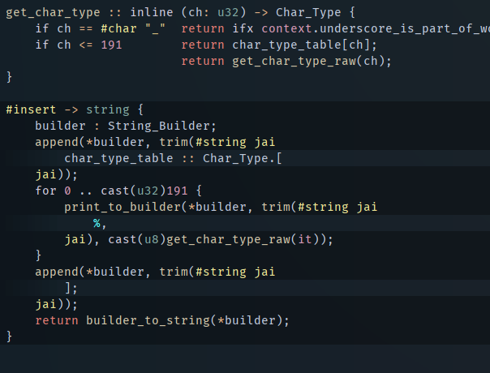

# This is a fork of Focus

This is not [the official version of Focus](https://github.com/focus-editor/focus/), this is a highly personalised fork of it; it may be to your taste, or it may not.  Maybe you would prefer a more standardized editor: if you don't like this version then check out the official one (if you haven't already).

Note that this fork is developed and used on Windows: not all features are present on other platforms (and the fork may not work on them either!)

## How this fork is different:

In a lot of ways! Some big, some small:

### Look & Feel @TODO
* Remove title bar / standard Windows gadgets (behaves more like a fullscreen borderless window).  You can move the window around by dragging the file tab in the top right.  If you're not using a window layout manager (like FancyZones in PowerToys) you can resize by right-clicking it, selecting `Size` and then hitting arrow keys. You can revert back to the normal title bar by turning off some bool constants at the top of `main.jai`.
* You can set the size and position of the window via Ficus script (see Ficus section below): run `window_location? print` (or just type `window_location?` into the calculator) to see the current dimensions (x, y, w, h), and in your `on_load` script use `<x> <y> <w> <h> window_location!`.
* Decorations: graphical elements added within the text, For instance, color squares drawn next to color settings in config files.
* Filename tab can be hidden using `Toggle Show Filename` command, or with Zen Mode (described below).
* `Collapse Leading Whitespace` command: if all code on screen is indented then all common leading whitespace will be collapsed.  Indicators at top and bottom of screen show how many indents have been elided.
* Almost all animations have been removed: compile with `SKIP_CUTSCENES` disabled to restore them.
* Changed `toast` popup messages to a more compact, single-line form (moving left across top of screen instead of up from bottom).
* Pleasant gradient on background, cursor glow effect to highlight cursor position (control with `cursor_glow_intensity` & `cursor_glow_percent` setting - set the first to 0 to disable).  Recommend not combining with `highlight_line_with_cursor` - use one or the other.

### Parsing @TODO
* Added Markdown parsing.
* Parsing works on document sections as well as entire documents. i.e. You can embed a Jai string inside a Markdown document code block and have it colored correctly.
* Documents are given Section delimiters you can easily jump to. These are split into important (i.e. H1/H2 in Markdown, #scope_ declarations in jai) or regular (All headers in Markdown, procedure declarations in Jai).  Jump between them with `move_up_one_section`, `move_down_one_section`, `move_up_one_important_section`, `move_down_one_important_section`.

### Jai specific features @TODO
* Simple goto definition - `jump_to_definition`. Requires you to turn on the settings `ignore_whitespace_in_finder` & `ignore_whitespace_in_search_bar`.
* Scope regions: background color is changed depending on whether you are in `#scope_file`, `#scope_module` or `#scope_export`.
* Compile-time regions: background color is changed for various compile time sections of code, to make it easier to see what the generated code looks like.
* Error parsing on build, cycle through errors with `jump_to_error`, `jump_to_previous_error`, clear them by building again or with `clear_build_errors`.
* Added jump to added string source / jump to comments source location.



### Ficus
Ficus is a scripting language you can use to interrogate and control Focus.  Primarily it's used to set up the default build actions for a project.

Ficus is a stack-based language, a derivative of Forth.  It works by putting things onto a stack and then applying functions to that stack.  In simple terms this means operations are postfix: for example, where you might be used to typing:
```
(a + b) * c
```
in Ficus you would type:
```
a b + c *
```
That is: put `a` on the stack, put `b` on the stack, add them (so now the stack contains one item: the sum of `a` and `b`), put `c` on the stack, multiply.  You can see this in action by opening the Calculator (search for it in the command runner, default `ctrl-shift-p`), which evaluates its contents using Ficus.  Watch what happens to the output as you type in `1 2 + 3 *`.

You can create Ficus scripts in three places: your global config, your project config, and in any file.  You can run code in the current editor by using the `Ficus Run Current` command.  If you want an empty buffer to test some Ficus code, you can use the `Create New Ficus File` command.

Functions in Ficus are called Words.

* `ficus_debug_on_error`


### Build @TODO

### Console @TODO
* Floating editor window which shows info / output from operations (such as builds).
* `Open Console Buffer` command.

### Zen mode @TODO
`zen_mode_blend_percent`
`zen_mode_minimal`
`zen_mode_width_in_chars`

### Misc
* Added setting `can_cancel_go_to_line` - hitting escape after typing the number leaves you at the destination, instead of taking you back to where you were.
* Added command `center_viewport_on_cursor`, added setting `scroll_to_cursor_line_offset` to control it.
* Reworked Editor History.
* Added `create_cursors_around` - will add cursors above and below your current cursor, for all the lines above and below which are long enough to have a cursor at that position.
* Eye tracking for tobii eye-tracking devices.
* Buffer switcher - `move_to_previous_buffer` & `move_to_next_buffer`, usually bound to ctrl-tab / ctrl-shift-tab.
* Autoindent as you type for braced languages.
* Jump to matching bracket - `jump_to_matching_bracket`.
* Settings `ignore_whitespace_in_finder` & `ignore_whitespace_in_search_bar` - make space behave as a simple wildcard in searches (less useful now Focus has regex).
* Text is only copied to the clipboard when you use `copy` or `cut` (you don't magically trash your clipboard while deleting text).
* Config allows you to type a numeric keycode instead of a keycode name.  If you want to bind a key but don't know what it's called, use the `Toggle Show Keystrokes` command to find out it's keycode, and enter the number directly. For example, `Ctrl-96  toggle_console`.
* `Show Icon Search` command, which lets you search through icons available for drawing in Focus.  Useful for Focus devs, and perhaps if you want to use an icon in a Ficus script.
* Added `change_case_to_upper`, `change_case_to_lower`, `change_case_to_caps`, `change_case_cycle`.
* Added `hide_current_buffer` command: equivalent to closing the current tab in other editors.
* Added "Convert Current Buffer To [colors]" to generate theme from vscode theme json: paste json from your vscode into a buffer then run this command to convert it to a Focus setting equivalent (roughly).
* Change window title to show project first (so when you look at theOS task bar you have a better idea of what to click on).
* Improved word jump / select word.
* Added cursor row highlight (now also present in main fork, but this one is prettier!).  Control color with `background_cursor_row` setting.
* Adding cursor above/below now skips blank lines.
* Added `show_cursor_position` command and setting.
* Added `show_fps` command and setting.
* Added `toggle_show_keystrokes` command.
* Added `jump_to_matching_bracket` hotkey.
* Added Quit command.
* Added profiling tool (Iprof) to dev version (focus_dev.exe). Toggle with `Toggle Profiling` command.
* Added Icon Search dialog, show with `Show Icon Search` command. Useful for Focus (and Ficus!) developers.
* Fixed non-cut delete actions copying text to clipboard.
* Moving cursor up/down past edge of file moves it to start/end of file.
* Calculator